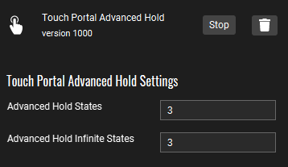
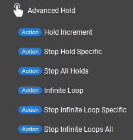
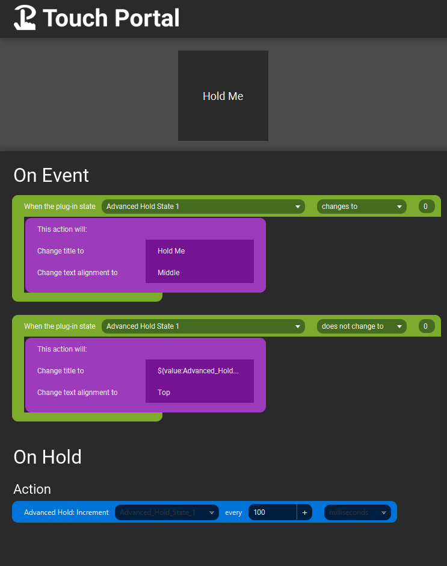
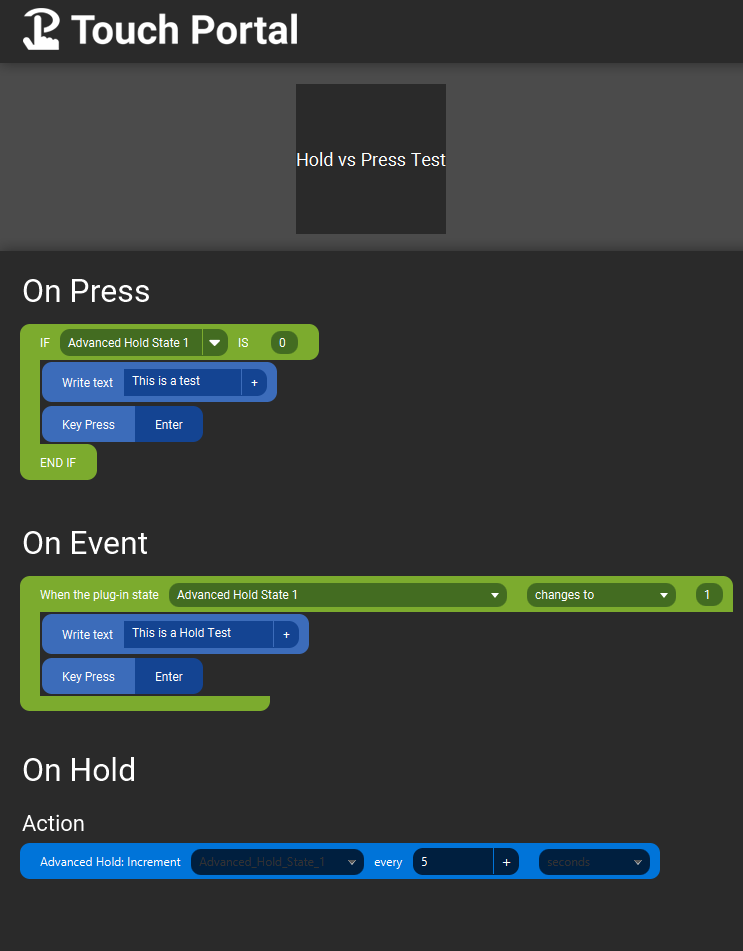
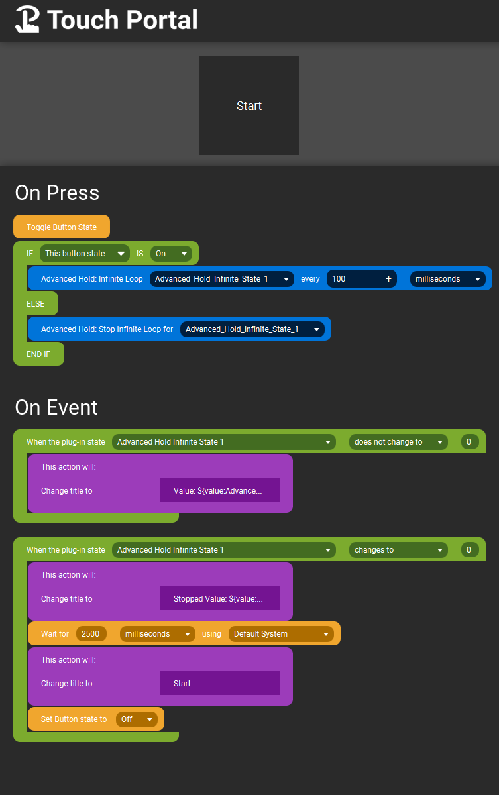

# TouchPortal Advanced Hold Plugin


- [TouchPortal Advanced Hold Plugin](#touchportal-advanced-hold-plugin)
  - [ChangeLog](#changelog)
  - [Known Issues](#known-issues)
  - [Description](#description)
  - [Installation](#installation)
  - [Settings](#settings)
  - [States](#states)
  - [Actions](#actions)
    - [Action List](#action-list)
  - [Examples](#examples)
    - [Hold and Trigger Event](#hold-and-trigger-event)
    - [Hold Or Press Example](#hold-or-press-example)
    - [Infinite Loop](#infinite-loop)
  - [Versioning](#versioning)
  - [Authors](#authors)
  - [License](#license)

## ChangeLog
```
v1.1.0
  - added 2 new actions
    - "Stop Hold Specific"
      - Specify a specific hold state to stop holding (in case of page change) and set state back to 0
    - "Stop All Holds"
      - Will killy held actions currently running and set state back to 0
  - Added Known Issues to README
```

## Known Issues
1) On MacOS, the sh script used to start the plugin doesn't like to work when the main folder path contains a space character. Still doing research on what to do to solve it.

## Description
Be able to hold a key down and repeat a set of actions every X seconds/milliseconds <br>
Press a button and turn on an infinite loop to repeat every X seconds/milliseconds <br>
Be able to now either Press or Hold a button to do different Actions:
   - Hold for 2 seconds trigger action via an onEvent trigger
   - Tap button and trigger actions in onPressed only

## Installation
1. Download the .tpp file for your platform
   1. [Windows](Installers/TPAdvancedHold-Win.tpp)
   2. [Mac](Installers/TPAdvancedHold-Mac.tpp)
2. Import plugin using the Wrench Icon in the top of the TouchPortal PC Window
3. Click "Ok" when told it Successfully Imported
4. If this is your first time importing the plugin also click "Trust Always" so you are not prompted every time Touch Portal starts
5. If this is your first plugin, you will need to close Touch Portal completely after import.
   1. `Windows` - right-clicking on the Touch Portal icon in the system tray and select Exit
   2. `Mac` - click on the Touch Portal icon in the top menu bar and select Exit
6. By default there will be 1 on hold state and 1 infinite state created, see [Settings](#settings) for how to configure

## Settings
Available Settings are listed here:<br>
<br>


- **Advanced Hold States**: How many states you want available to be used for holding a button down
- **Advanced Hold Infinite States**: How many states you want available to be used for inifinite loop purposes

These states are created dynamically by the plugin, they both should default to 1 on initial import. Once you change them, it will automatically create the new states for you to use. 

It will also remove states if you decrease the value below the last time it created states. So if you went from 3 to 1 **Advanced Hold States** you will only have 1 left, buttons that may have used the other state will not function properly.

Maximum number for each is 100<br>
Minimum number for each is 1

## States

These states are created dynamically by the plugin and controlled by the [Settings](#settings) above.

Each state created will be in this format:
   - Advanced_Hold_State_#
   - Advanced_Hold_Infinite_State_#

## Actions
<br>



<br>

### Action List
- Hold Increment
  - Increment a specific State Value by 1 every X seconds/milliseconds
  - On release, return value to 0
- Stop Hold Specific
  - Stop a specific state's hold from executing and return value to 0
- Stop All Holds
  - Stop all running holds and return value to 0
- Infinite Loop
  - Increment (until stopped, or plugin is closed) a specific State Value by 1 every X seconds/milliseconds
- Stop Infinite Loop Specific
  - Stop a specific state's infinite loop from executing and return value to 0
- Stop Infinite Loops All
  - Stop all running infinite loops and return value to 0

All values will cycle from 1 to 100000 and then loop repeat back to 1

Minimum time loop is 100ms, even if you put in 1ms it will force 100 ms in the plugin code.

All states will reset back to 0 upon restart of Touch Portal and/or Plugin


## Examples

### Hold and Trigger Event

This Example is to show the basic Usage to hold down a button an every 100ms will increment `Advanded Hold State 1` and change the title of the text to it's value

Upon release, the `Advanced Hold State 1` will be set back to 0 and the text will be reverted to default



### Hold Or Press Example

This example is to show how this plugin can be used to trigger on hold (with event actions) or just a singular on press.

Since On Press fires AFTER on Hold, if you hold this button for 5 seconds, the text "This is a Hold Test" will be written, and upon release, the On Press will execute but because `Advanced Hold State 1` is not reset yet, it will not trigger.  This has worked 100% with my tests.

If you just do a quick tap, this will allow the "This is a test" to fire, and the on Hold portion will not fire at all.



### Infinite Loop

This example is to show how to start and stop an infinite loop using the Button state as the trigger for the actions in On Press.  

This will loop forever with values from 1 -> 100000 (will start back at 1 when it hits 100000) until the action to stop the infinite loop specific (or all infinite loops), or Touch Portal or the Plugin is closed.



## Versioning

We use [SemVer](http://semver.org/) for versioning. For the versions available, see the [tags on this repository](https://github.com/spdermn02/TouchPortal_AdvancedHold_Plugin/tags).

## Authors

- **Jameson Allen** - _Initial work_ - [Spdermn02](https://github.com/spdermn02)

## License

This project is licensed under the MIT - see the [LICENSE](LICENSE) file for details
